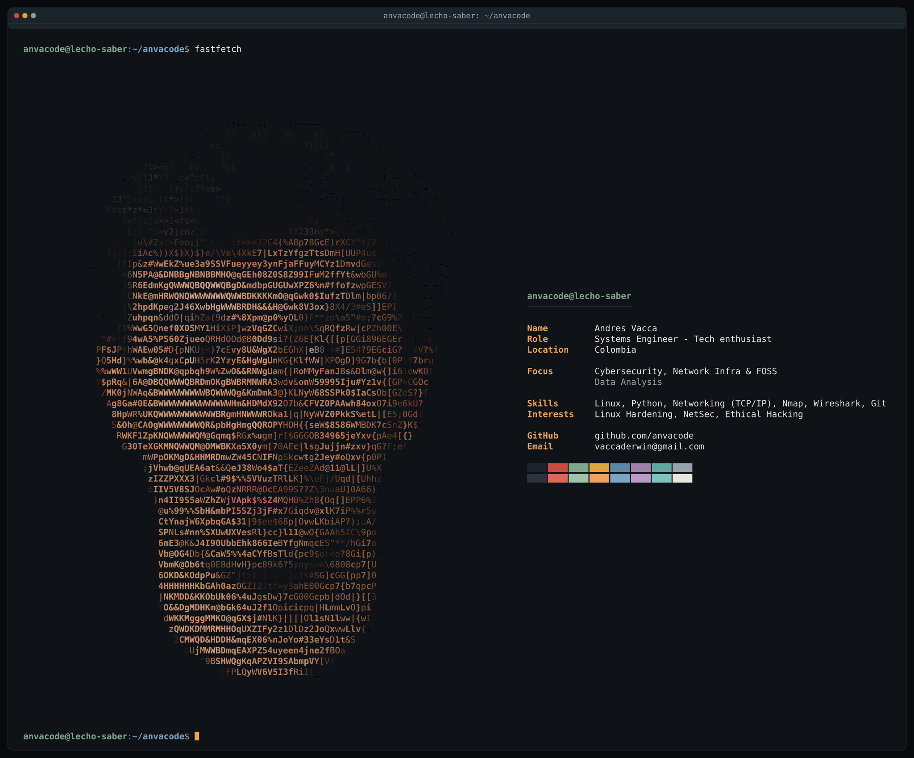

## Tech Stack

### Languages

### Frontend & Mobile

### Backend & Databases

### DevOps & Tools

---

## Featured Projects

> *Check out my portfolio for a complete view of my work*

---

## Connect

I'm always open to interesting conversations, collaboration opportunities, or just a friendly chat about tech.

---
